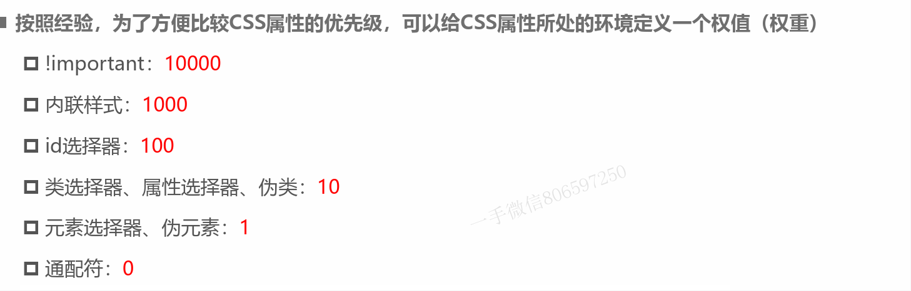
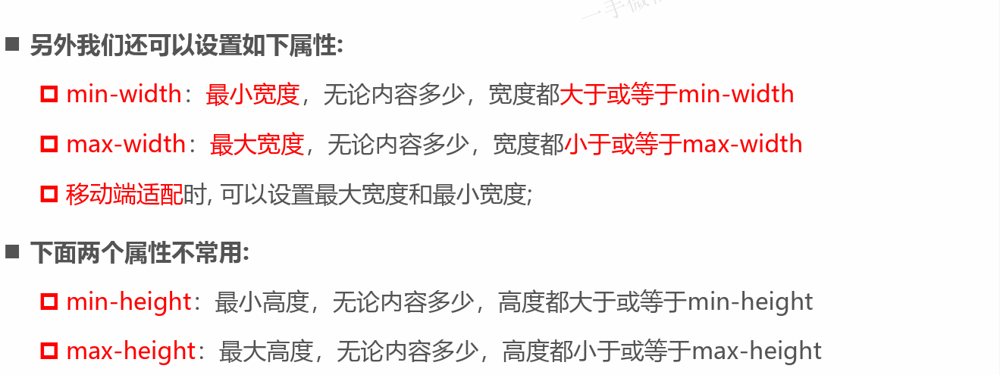
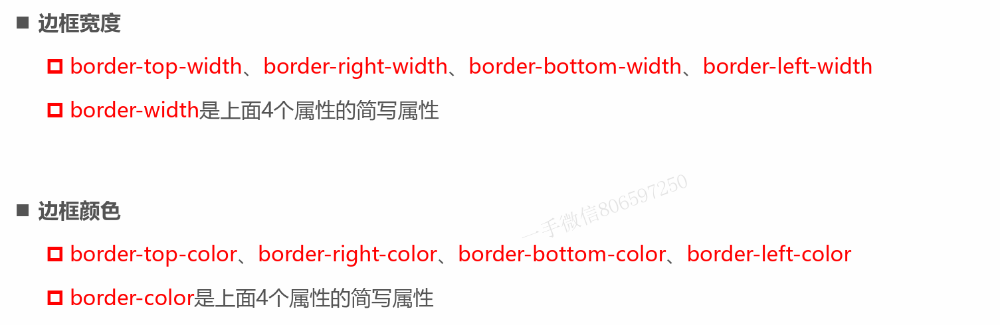
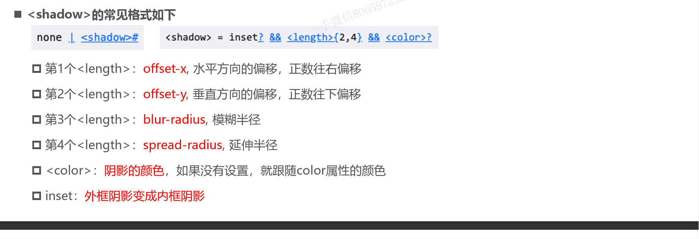
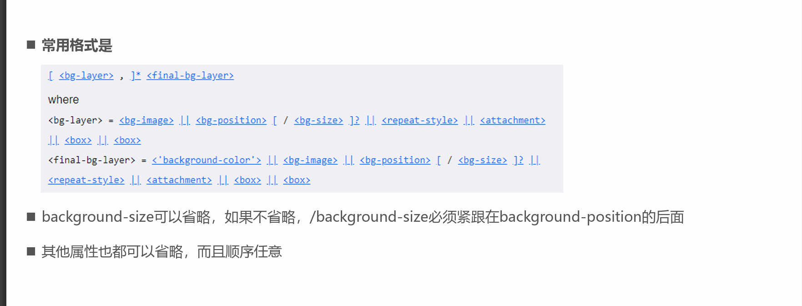
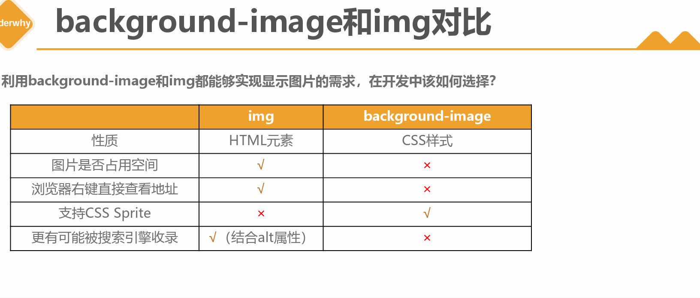

- font-size: 文字大小
- color: 前景色
- background-color: 背景色
- width: 宽度
- height：高度

# 颜色表示法：
- 颜色关键字: https://developer.mozilla.org/zh-CN/docs/Web/CSS/color_value#%E8%AF%AD%E6%B3%95
- RGB颜色： 
    R：red
    G：green
    B: Blue
三原色取值范围：0 - 255
- RGB颜色表示法：
    - 16进制: #RRGGBB[A] A：可选值
    #f09=#ff0099
    #0f38=#00ff3388
- 函数法
    rgb[a](R、G、B[,A]) A:0-1之间的数字，或者百分比：1=100% 完全不透明
# 文本属性
##  text-decoration: 用于设置文字的装饰线， 实际开发用javascript开发比较多
- none:无任何装饰线，<B>可以去除a元素默认的下划线</B>
- underline:下划线
- overline: 上划线
- line-througn: 中划线，删除线
## text-transform: 用于设置文字转换的大小写
- capitalize: 使每个单词的首字符变为大写
- uppercase: 每个单词的所有字符变为大写
- lowercase: 每个单词的所有字符变为小写
- none:没有任何影响
## text-indent: 用于设置第一行内容的缩进
- text-indent: 2em:缩进2个文字
## text-align: 定义行内内容，如何想对它的块元素对齐
- left：左对齐
- right：右对齐
- center:正中间显示
- justify：两端对齐
## left-spacing, word-spacing: 用于设置字母、单词之间的间距
- 默认是0，可以设置为负数
# 字体属性
## font-size:设置字体大小
- 数值+单位：100px，em不推荐：1em=100%,2em=200%,0.5em=50%
- 百分比：基于父元素的font-size计算，50%表示是父元素font-size的一半
## font-family:设置文字的字体名称
- 可以设置1个或多个字体
- 可以通过@font-face:指定下载的字体
## font-weigth:设置文字的粗细
- 100|200|300|400|500....|900
- normal: 等于400
- bold:等于700
- strong、b、h1-h5 font-weight默认是bold
## font-style: 用于设置文字格式内容
- normal: 常规显示
- italic: 用字体的斜体显示
- oblique: 文本倾斜显示
- em/i/cite/address/var/dfn 等元素的的font-style默认就是italic
## font-variant: 影响小写字母的显示形式
- normal:常规显示
- small-caps: 将小写字母替换为缩写过得的大写字母
## line-hegith: 设置文本的行高
- hegiht: 元素整体的高度，line-heigh:元素的每一行文字所占据的高度
## font
- font 属性可以用来作为font-style, font-variant, font-weight, font-size, line-height 和 font-family 属性的缩写

# 选择器
> 选出符合条件的元素 
## 通用选择器
- 效率比较低，尽量不要使用
## 简单选择器
- 元素选择器，使用元素的名称
- 类选择器，.类名
- id选择器 #id
## 属性选择器
- 拥有某个一个属性[att]
- 属性等于某一个值[att=val]
## 后代选择器
- > 分割
## 兄弟选择器
- 相邻兄弟选择器，+ 分割
- 普遍兄弟选择器，~ 分割
## 交集选择器
- 开发中精确的选择某一个元素 dev.one
## 并集选择器
- 符合一个选择器的条件即可，两个选择器,号分割
- 开发中通常为了给多个元素设置相同的样式
# 伪类
> presudo-class，选择器的一种，选择处于特定状态的元素
- [伪类](https://developer.mozilla.org/zh-CN/docs/Web/CSS/Pseudo-classes)
## 动态伪类
- a:link, a:visited, hover,active
- :focus: 拥有输入焦点的元素
- ::before,::after

# 属性继承
- font-size/font-family/font-weight/line-height/color/text-align都具有继承
# 属性层叠

# 元素类型
- 块级元素：独占父元素的一行
- 行内级元素：多个行内级元素在父元素的同一行中显示

<B>元素本质上是没有差异的，div之所有事块级别元素，因为浏览器默认设置了display属性</B>
换言之，我们可以利用display属性改变元素属性
- block:元素显示为块级元素
    - 独占父元素的一行
    - 可以随意设置宽高
    - 高度默认有内容决定
- inline: 让元素显示为行内级元素
    - 跟其他元素在同一行显示
    - 不可以随意设置宽高
    - 宽高都由内容决定
- inline-block: 让元素同是具备行内级，块级元素的特征
    - 跟其他行级元素在一行显示
    - 可以随意设置宽高  
    - 对外来说，是一个行内级元素，对内是一个块级元素
    - 一般情况下，可以包含其它元素，特殊情况，p元素不能包含其它元素
- none:隐藏元素
- flex
## 元素的隐藏方法
- display:none, 元素不显示出来，不占据任何位置
- visibility:hiddent,元素不可见，但会占据位置
- rgba设置颜色，将a的值设置为0，不影响子元素
- opacity设置透明度，设置为0 ，影响所有的子元素
## overflow
> 用于控制内容溢出时的行为
- visible:溢出的内容依旧可见
- hidden:溢出的内容进行裁剪
- scroll:溢出的内容被裁剪，但可以通过滚动机制查看
- auto: 根据溢出的内容自动是否提供滚动机制
## css样式不生效技巧
- 选择器的优先级太低
- 选择器没有选中对应的元素
- css属性不对

# 盒子模型
> html中的每个元素都可以看做是盒子
## 基本属性
- 内容
- padding
- border
- margin

## content
- width
- height

## padding
- padding-top,padding-right,padding-bottom,padding-left
- 从零点中方向开始，顺时针，上右下左
## boder
- width
- style
    - groove: 凹槽
    - ridge:山脊
- color

- boder-radis:设置盒子的圆角
    - 数值：6px
    - 百分比    
> 如果元素是一个正方形，width、heigth宽高度大于50%，就会变成一个圆
## margin
> 盒子的外边距，元素与元素之间的间距
### 上下margin的传递
- margin-top传递
    - 如果块级元素的顶部线和父元素的顶部线重叠，那么这个块级元素的margin-top值会传递给父元素
- margin-bottom传递
    - 如果块级元素的底部线和父元素的底部线重写，并且父元素的高度是auto，那么这个块级元素的margin-bottom值会传递给父元素
- 如何防止传递问题
    - 给父元素设置padding-top\padding-bottom
    - 给父元素设置border
    - 触发BFC: 设置overflow为auto
<B>
### 上下margin的折叠
- 垂直方向上相邻的2个margin（margin-top、margin-bottom）有可能会合并为1个margin，这种现象叫做collapse（折叠）
- 水平方向上的margin（margin-left、margin-right）永远不会collaps
- 折叠后的最终计算规则：两个值进行比较，取较大的值
- 如何防止margin collapse? 只设置一个元素的margin
## 外轮廓：outline
- 不占用空间
- 默认显示在border的外面
- outline-width:外轮廓的宽度
- outline-style: 取值跟border的样式一样，比如solid,dotted等
- outlie-color: 外轮廓颜色
- outline：outline-width、outline-style、outline-color的简写属性，跟border用法类型
<B>去除a元素，input的focus轮廓效果</B>
## 盒子阴影 box-shadow
- 可以设置一个或多个阴影
- 多个阴影之间用逗号隔开，从前到后叠加

- 文字阴影：text-shadow
## box-sizing
- 用来设置盒子模型的宽高行为
- content-box: padding、border都布置在width、height外边
- boder-box: padding、border都布置在width、height里边
## 元素的水平居中方案
- 行内级元素
    - 水平居中：父元素设置text-align:center
- 块级元素
    - 水平居中： margin: 0 auto 

# 设置背景
## background-image
用于设置元素的背景图片，如果设置多张图片，第一张显示在最下面，其他图片按顺序层叠在下面
**如果设置了背景图片，元素没有具体的宽高，背景图片是不会显示出来**
## background-repeat
设置图片是否平铺
- repeat: 平铺
- no-repeat: 不平铺
- repeat-x: 只在水平方向上平铺
- repeat-y: 只在垂直方向上平铺
## background-size
- auto: 默认值，以背景图片本身大小显示
- cover:缩放背景图，以完全覆盖铺满元素,可能背景图片部分看不见
- contain：缩放背景图，宽度或者高度铺满元素，但是图片保持宽高比
- <percentage>：百分比，相对于背景区（background positioning area）
- length：具体的大小，比如100px
## background-position
用于设置背景图片在水平，垂直方向上的具体位置
## background-attachmen
-  background-attachment决定背景图像的位置是在视口内固定，或者随着包含它的区块滚动。
    - scroll: 此关键属性值表示背景相对于元素本身固定，而不是随着它的内容滚动
    - 此关键属性值表示背景相对于元素的内容固定。如果一个元素拥有滚动机制，背景将会随着元素的内容滚动
    - 此关键属性值表示背景相对于视口固定。即使一个元素拥有滚动机制，背景也不会随着元素的内容滚动。
## background
一系列属性的简称

## backgroupnd与img比较

- img作为网页内容的重要部分
- background-img 可有可无

# html高级元素
## 有序列表
- ol: ordered list
- li: list item
## 无序列表
- ul: unordered list
- li: list item
## 定义列表
- dl
- dt
- dd
## 表格
- table,
- tr (table row)
- td (table data)
- thead 表头
- tbody 表格主体
- tfoot 表格页脚
- th 表头单元格
- colspan
- rowspan
# emmet语法
- !、 html5
- div>ul>li
- div+div>p>span+i
- ul >li*5
- div+div
- ul>li.item$*5
## 结构伪类
- :nth-child(1)
- :nth-child(2n)
- :root 根元素

# css
- [css制作图形](https://css-tricks.com/the-shapes-of-css/#top-of-site)
## web字体 Web Fonts
# 元素定位
## normal flow 标准流
- 从左到右，从上到下
- 默认情况下，互相之间不存在层叠现象

## margin-paddin位置调整
- 会影响其他元素的定位效果
- 不便实现层叠的效果
## position属性
- static
    - 默认值，静态定位，normal flow
    - left right top botton 没有任何作用
- relative: 相对定位
    - normal flow
    - left right top botton 参照对象是元素自己原来的位置
    - 使用场景，不影响其他元素位置的前提下，对当前元素位置进行微调
- absolute:绝对定位
    - 脱离normal flow
    - left rigth top bottom 进行定位
    - 定位参照对象是最临近的定位祖先元素，如果找不到这样的祖先元素，参照对象是视口
    - 定位元素
        - position不为static的元素，relative absolute,fixed元素
    - 子绝父相
        - 绝大数情况下，子元素的绝对定位相对于父元素进行定位
        - 如果希望子元素相对于父元素进行定位，又不希望父元素脱标，常用解决方案是：
            - 父元素设置position: relative（让父元素成为定位元素，而且父元素不脱离标准流）
            - 子元素设置position: absolute

- fixed:固定定位
    - 脱离normal flow
    - left rigth top bottom 进行定位
    - 定位参照对象是视口
    - 画布滚动，固定不动 画布>=视口 
- sticky:粘性定位
    - 可以看做是相对定位和固定定位的结合体;
    - 它允许被定位的元素表现得像相对定位一样，直到它滚动到某个阈值点;
    - 当达到这个阈值点时, 就会变成固定定位;
## z-index
    - z-index属性用来设置定位元素的层叠顺序（仅对定位元素有效）
        - 正整数、负整数、0
### 比较原则
    - 兄弟关系； z-index越大，层叠在越上面，z-index相等，写在后面的那个元素层叠在上面
    - 不是兄弟关系，各自从元素自己以及祖先元素中，找出最邻近的2个定位元素进行比较,✓ 而且这2个定位元素必须有设置z-index的具体数值
# 元素浮动
- float属性
    - none:不浮动，默认值
    - left: 向左浮动
    - right: 向右浮动
- 浮动规则
    - 元素一旦浮动，脱离标准流
    - 如果元素是向左（右）浮动，浮动元素的左（右）边界不能超出包含块的左（右）边界
    - 浮动元素之间不能层叠
    - 浮动元素不能与行内级内容层叠，行内级内容将会被浮动元素推出
    - 规则五: 行内级元素、inline-block元素浮动后，其顶部将与所在行的顶部对齐
- 常用场景
    - 解决行内级元素、inline-block元素的水平间隙问题
# flex布局
- 弹性盒子是一种用于按行或按列布局元素的一维布局方法
- 元素可以膨胀以填充额外的空间, 收缩以适应更小的空间;
- 通常我们使用Flexbox来进行布局的方案称之为flex布局(flex layout)
- flex布局，目前开发中使用最多的布局方案

## css 属性
- flex-direction
    - row
    - row-reverse
    - column
    - column-reverse
- flex-wrap
    - nowrap:单行
    - wrap:多行
    - wrap-reverse：多行（对比 wrap，cross start 与 cross end 相反）
- flex-flow
    - 是 flex-direction 和 flex-wrap 的简写
- justify-content
    - justify-content 决定了 flex items 在 main axis 上的对齐方式
    - flex-start: 与main start 对齐
    - flex-end: 与main end对齐
    - center:  居中对齐
    - space-between
    - space-around
    - space-evenly
- align-item 
    - align-items 决定了 flex items 在 cross axis 上的对齐方式
    - normal
    - stretch
    - flex-start
    - flex-end
    - center
    - baseline
- align-content
    - stretch
    - flex-start
    - flex-end
    - center
    - space-between
    - space-around
- order
    - order 决定了 flex items 的排布顺序
    - 可以设置任意整数（正整数，负整数，0），值越小就越排在前面

