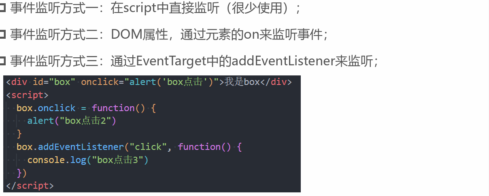
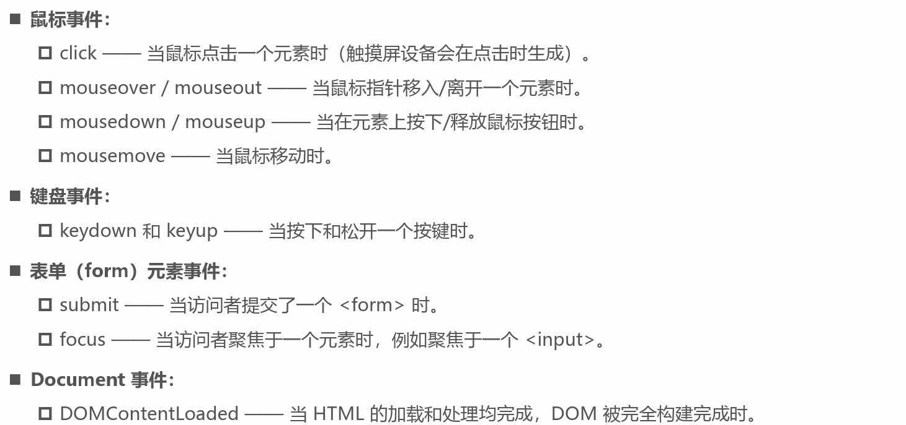
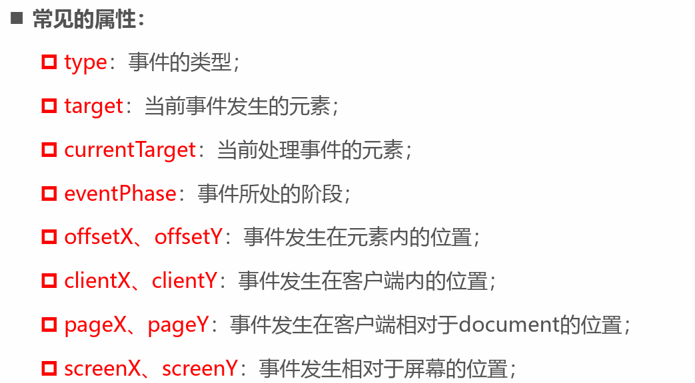
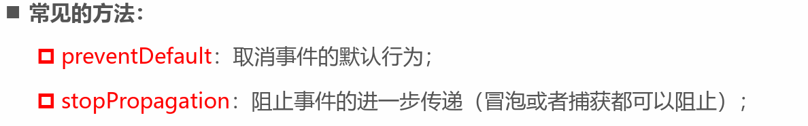
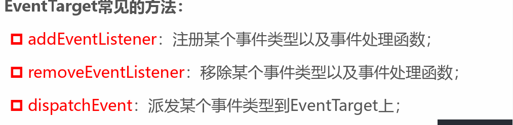
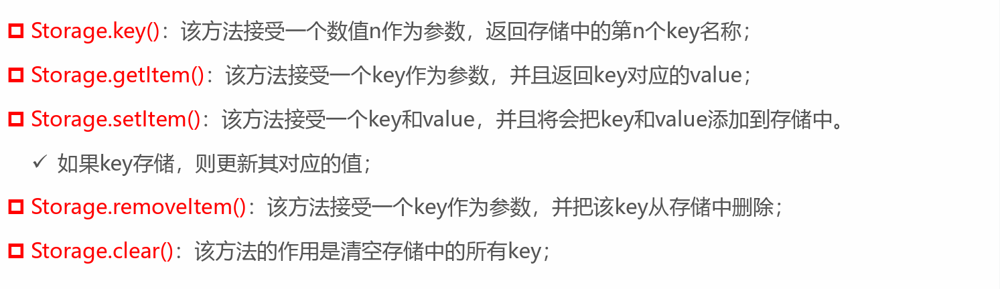

# JavaScript引擎
- SpiderMonkey
- Chakra
- JavaScriptCore
- V8
# js语法
- <noscript>浏览器不支持JavaScript
- type属性可以省略，默认脚本语言
- 推荐将javascript代码和编写位置放置在body子元素最后一行
# 基本数据类型
- Number
- String
- Boolean 
- Underfined
- Null
- Object
- Bigint
- Symbol

## typeof操作符
> 用于确定变量数据类型
- undefined: 值未定义
- boolean 布尔值
- string 字符串
·- number 数值：整数与浮点数·
    - infinity: 无穷大
    - NaN: 计算错误
    - isNaN:用于判断是否是一个数字
- object 对象
    - 引用类型、复杂数据类型
    - Null 特殊值
    - null 与underfined的关系
        - undefined通常只有在一个变量声明但是未初始化时，它的默认值是undefined才会用到
        - 并且我们不推荐直接给一个变量赋值为undefined，所以很少主动来使用
        - null值非常常用，当一个变量准备保存一个对象，但是这个对象不确定时，我们可以先赋值为null

- function 函数
- symbol 符号
## 字符串转换
- 隐式转换
    - 如果+运算符左右两边有一个是字符串，那么另一边会自动转换成字符串类型进行拼接
    - 某些函数的执行也会自动将参数转为字符串类型
- 显式转换
    - 调用string()函数
    - toString()
## 数字类型转换
- 隐式转换
    - 在算数运算中，通常会将其他类型转换成数字类型来进行运算
- 显式转换
    - Number函数
## 布尔类型转换
- Boolean()进行转换
- 直观上为“空”的值（如0、空字符串、null、undefined 和NaN）将变为false，其他转为false
- 注意：包含0 的字符串"0" 是true

## === 与== 的区别
- 普通的相等性检查== 存在一个问题，它不能区分出0 和false，或者空字符串和false这类运算：
- 严格相等运算符=== 在进行比较时不会做任何的类型转换
- 同样的，“不相等”符号!= 类似，“严格不相等”表示为!==
# 高阶函数
- 接受一个或多个函数作为输入
- 输出一个函数
# 原始类型与对象类型内存分配区域
- 原始类型在栈内存
- 对象类型在堆内存

# 事件监听
- script中直接监听
- dom属性，通过元素的on
- 通过EventTarget的addEventListener来监听

## 常见事件

## 事件流
因为元素是叠加的
## 事件冒泡和事件获取
- 默认情况下事件是从最内层的span向外依次传递的顺序，这个顺序我们称之为事件冒泡（Event Bubble）
- 事实上，还有另外一种监听事件流的方式就是从外层到内层（body -> span），这种称之为事件捕获（Event Capture）
- 捕获阶段
- 目标阶段
- 冒泡阶段

**通过event对象来获取当前的阶段**
## event常见的属性和方法

## eventTarget
- dom接口，添加、删除、派发Even事件

# 包装类型
- String
- Number
- Boolean
- Symbol
- Bigint类型
> 调用原始类型的属性或方法
- 根据原始值，创建一个原始类型对应的包装类
- 调用对应的属性或者方法，返回一个新的值
- 创建的包装类对象销毁
- 通常JavaScript引擎会进行很多的优化，它可以跳过创建包装类的过程在内部直接完成属性的获取或者方法的调用

# storage
- localStorage:本地存储，提供的是一种永久性的存储方法，在关闭掉网页重新打开时，存储的内容依然保留
- sessionStorage：会话存储，提供的是本次会话的存储，在关闭掉会话时，存储的内容会被清除
## 区别
- 关闭网页后重新打开，localStorage会保留，而sessionStorage会被删除
- 在页面内实现跳转，localStorage会保留，sessionStorage也会保留
- 在页面外实现跳转（打开新的网页），localStorage会保留，sessionStorage不会被保留
## 属性
- Storage.length: 返回storage对象的数据项
## 方法

# 防抖 、节流
## 防抖
- 只有在某个时间内，没有再次触发某个函数时，才真正调用这个函数  debounce
## 节流
- 不管触发多少事件，执行函数频繁是固定的
- Underscore库用来实现